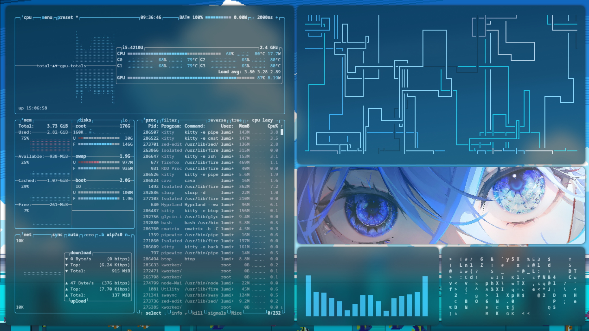
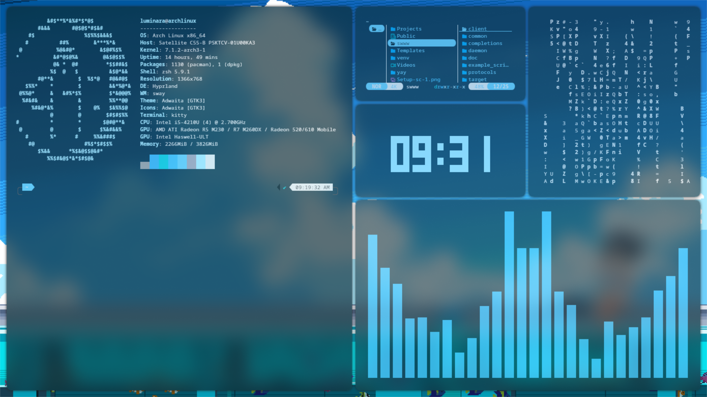
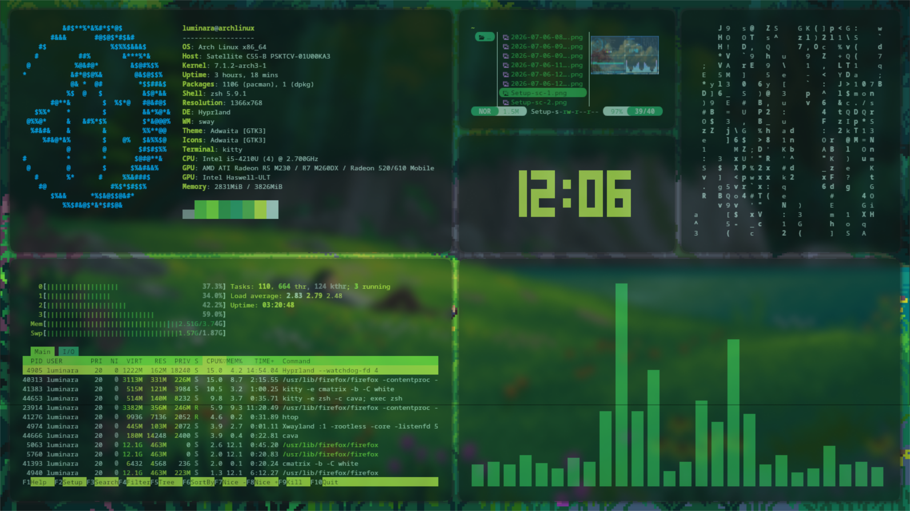
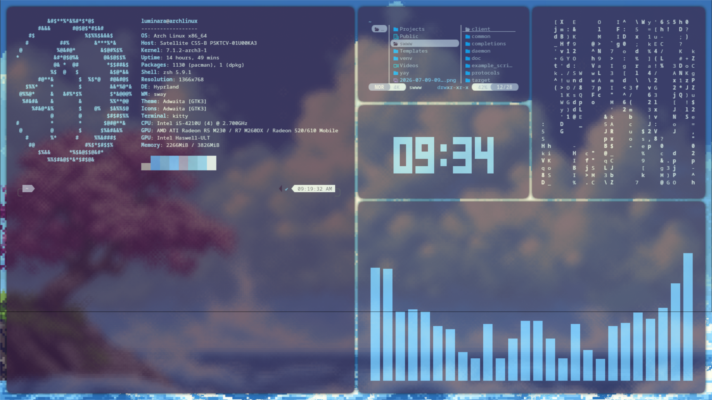
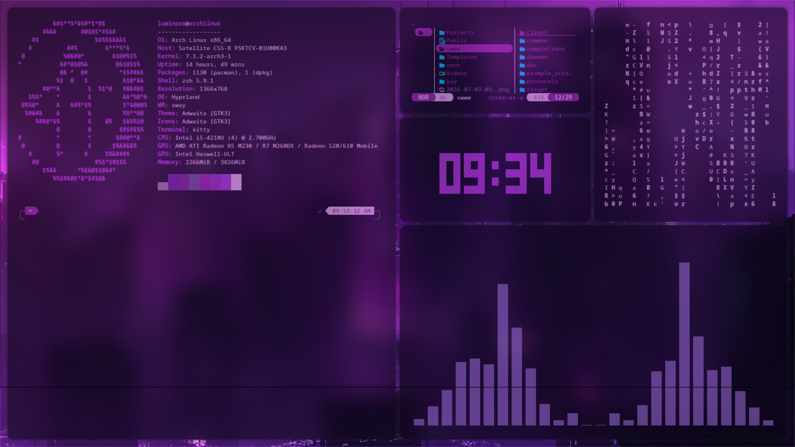
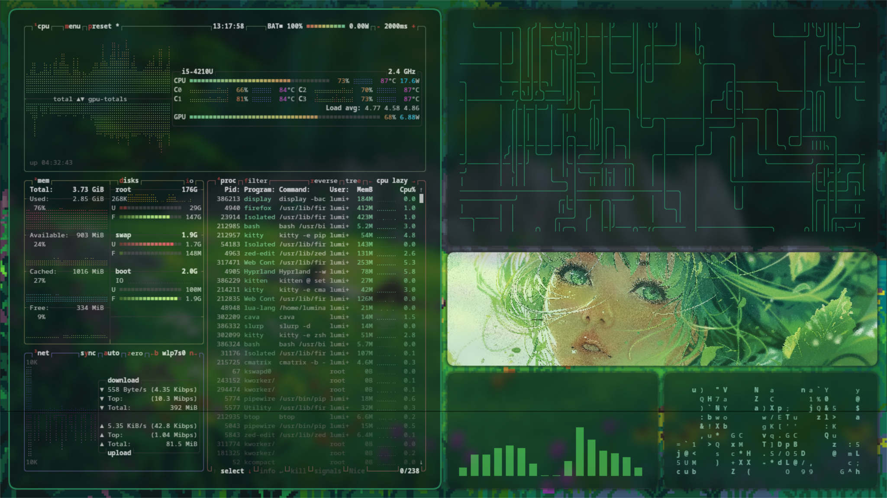
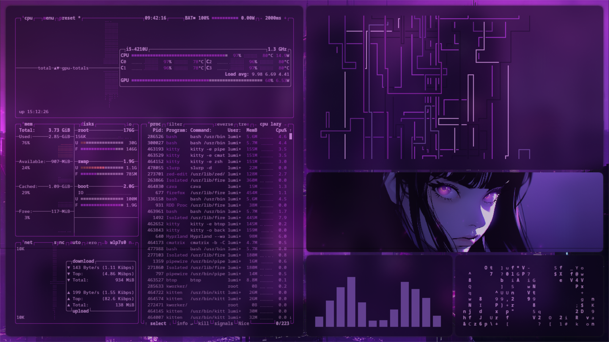
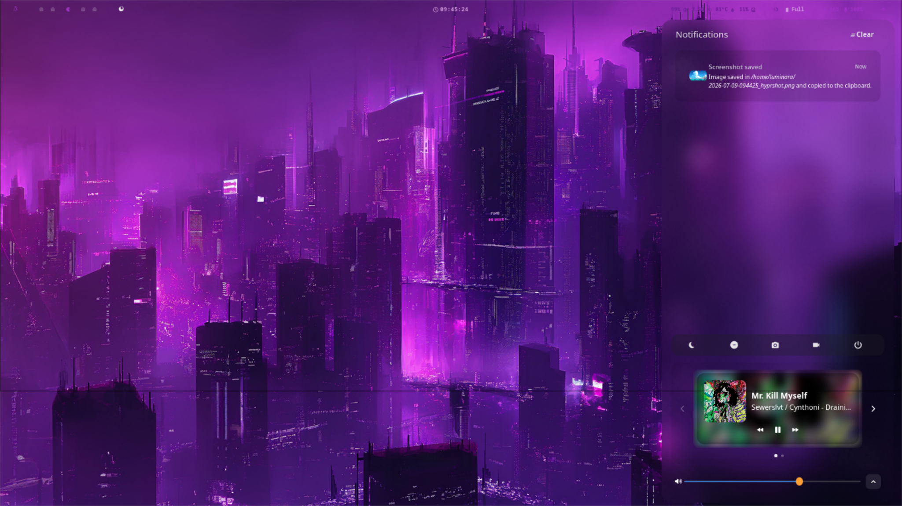

# Hyprland Dotfiles

My personal Hyprland rice — Lua-based config, wallpaper/color sync, custom keybinds, and a themed swaync/waybar setup.



## Table of Contents

- [Dependencies](#dependencies)
- [Wallpaper & Color Sync](#wallpaper--color-sync)
- [Waybar](#waybar)
- [SwayNotificationCenter (swaync)](#swaynotificationcenter-swaync)
- [Workspace 1 — Tiled Dashboard Layout](#workspace-1--tiled-dashboard-layout)
- [Toggle Scripts](#toggle-scripts)
- [Window Rules & Transparency](#window-rules--transparency)
- [Terminal (kitty) Tricks](#terminal-kitty-tricks)
- [GRUB Theme](#grub-theme)
- [SDDM Theme (Pixie)](#sddm-theme-pixie)
- [Notes on the Hyprland Lua Config](#notes-on-the-hyprland-lua-config)

---

## Dependencies

```bash
sudo pacman -S waypaper swww jq btop cava unimatrix yazi tty-clock
yay -S python-pywal
```

Other tools referenced below: `swaync`, `waybar`, `kitty`, `pipes.sh`, `fastfetch`.

---


## Wallpaper & Color Sync

Wallpapers are set via `waypaper`/`swww`, with `pywal` regenerating a color palette from each new wallpaper and syncing it to waybar and the Hyprland active border color.

- `SUPER + SHIFT + [0-9]` — quick wallpaper switch only (no color sync)
- `SUPER + CTRL + ALT + [2-9]` — full sync: sets wallpaper → regenerates pywal palette → updates Hyprland border color
- `SUPER + ALT + [2-9]` — wallpaper + pywal + waybar restart (keeps waybar colors current)

Script: `~/.config/hypr/scripts/wallpaper-sync.sh`

The whole workspace-1 dashboard (see below) re-themes automatically with whatever palette pywal generates:

| | | |
|---|---|---|
|  |  |  |
|  |  |  |
|  |  | |

---

## Waybar

Using the **Nova-dark** theme/colors from the [HyprNova](https://github.com/JaKooLit) dotfiles collection, with pywal-driven colors layered in via `colors-waybar.css`.

- `SUPER + B` — toggle waybar on/off (also adjusts swaync's control-center margin/height to compensate for the reserved space, see below)

---

## SwayNotificationCenter (swaync)

Custom "frosted glass" theme — blurred, low-opacity background instead of a solid dark panel, blue accent color throughout. Includes an mpris media widget, notification list, and a DND toggle.



Key fixes made along the way:
- Hyprland layer rule `match` must be a **table** (`{ namespace = "..." }`), not a bare string — this was the root cause of blur/animation silently not applying.
- `ignore_alpha` needs a small non-zero threshold (not `0`) to avoid blurring the entire transparent window bounding box.
- The `control-center-height` config field doesn't reliably work in this swaync version — actual panel height is fixed to full monitor height regardless of the config value, so margin-top/bottom are used instead to compensate for waybar's reserved space.

---

## Workspace 1 — Tiled Dashboard Layout

A dwindle-tiled dashboard that launches automatically on boot: fastfetch (custom ASCII art), yazi, `tty-clock`, `unimatrix`, and cava, arranged via sequential `preselect` split direction dispatchers. Colors across every panel — including the fastfetch ASCII, clock, and cava bars — automatically re-theme with whatever pywal generates from the current wallpaper (see the gallery under [Wallpaper & Color Sync](#wallpaper--color-sync) above).

```
┌──────────────┬─────────────┐
│              │ yazi        │
│ fastfetch    ├─────────────┤
│              │ tty-clock   │
│              ├─────────────┤
│              │ unimatrix   │
├──────────────┼─────────────┤
│              │ cava        │
└──────────────┴─────────────┘
```

---

## Toggle Scripts

Live, reload-free toggles using `hyprctl eval` (required instead of the legacy `hyprctl keyword` since this config uses the Lua provider):

| Script | Bind | Effect |
|---|---|---|
| `blur-adjust.sh size up/down` | `SUPER + Up/Down` | Increase/decrease blur size |
| `blur-adjust.sh passes up/down` | `SUPER + Right/Left` | Increase/decrease blur passes |
| `shadow-toggle.sh` | — | Toggle window shadows on/off |
| `border-toggle.sh` | `SUPER + B` * | Toggle window borders on/off (remembers last size) |
| `waybar-toggle.sh` | `SUPER + B` * | Toggle waybar + adjust swaync margins to match |

\* Note: these two currently share the same bind — reassign one before use.

---

## Window Rules & Transparency

Opacity window rules (`0.85` active / `0.75` inactive) applied to: Firefox, kitty, Zed, Spotify, Dolphin — paired with global blur for a frosted-glass look.

---

## Terminal (kitty) Tricks

- **Image-only kitty window** — launches with no shell prompt, no visible cursor, just a background image:
  ```bash
  kitty -o background_image=/path/to/image.jpg -o background_image_layout=cscaled \
        -o window_padding_width=0 -e sh -c 'printf "\e[?25l"; clear; sleep infinity'
  ```
- Custom fastfetch ASCII art with randomized bold keyboard characters (`# @ % & $ *`) — visible in the top-left panel of every dashboard screenshot above.

---

## GRUB Theme

Custom bordered boot menu using assets borrowed from GRUB's bundled `starfield` theme, background image, `gfxterm` output mode required for any of this to render (easy to silently miss).

---

## SDDM Theme (Pixie)

Modified the [pixie-sddm](https://github.com/xCaptaiN09/pixie-sddm) theme:
- Removed the avatar circle and login arrow button (`visible: false` in `Main.qml`)
- Removed the dark card background entirely (`color: "transparent"`), fixed the card's stale height/centering math
- Scaled down all hardcoded `font.pixelSize` values (the theme's `fontSize` config option isn't actually wired up in the QML — has no effect)
- Removed the top-left date text and top-right power/suspend/restart icon row (`PowerBar` component) for a cleaner, minimal login screen

---

## Notes on the Hyprland Lua Config

Since Hyprland 0.55+, config is Lua-based (`hyprland.lua`), which changes some things from older guides:

- `hyprctl keyword ...` **does not work** — use `hyprctl eval "hl.config({ ... })"` instead.
- `exec_cmd`'s workspace-assignment rules match by spawned PID — apps that fork into a separate GUI process (common with Electron apps) can silently fail to get assigned; use a `hl.window_rule` matched by `class` as a reliable fallback.
- `~` is not expanded when paths are wrapped in single quotes inside a shell string passed to `exec_cmd` — use absolute paths, or wrap the whole thing in `sh -c "..."`.
- Layer rules require `match = { namespace = "..." }` (a table), not a bare string.
